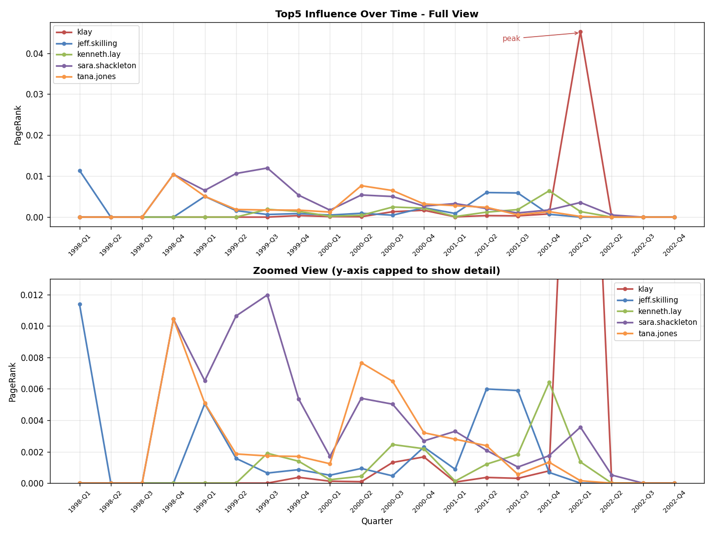

# Enron Graph Analytics on Apache Spark

Who actually held power inside Enron — and can you recover that from nothing but email metadata?

This project builds a communication graph from the ~517K-message Enron corpus and mines it with distributed algorithms written directly against the **Apache Spark Java RDD API**: PageRank and two weighted variants, a quarter-by-quarter *temporal* PageRank that tracks how influence shifted as the company collapsed, and a **K-Means implementation written from scratch** (no MLlib) that clusters 88K people by behavioural fingerprint.

Two results stand out. Ranking on graph structure alone puts Kenneth Lay and Jeffrey Skilling at the top — the two executives at the centre of the scandal. And the clustering isolates a group of **2,303 people who send 84% of their mail between midnight and 6am**, a behavioural signature invisible to any volume-based metric.

<p align="center">
  
</p>

---

## Scale

| | |
|---|---|
| Source corpus | ~517,000 emails (Enron, public record) |
| Unique people (nodes) | **88,560** |
| Communication edges | **~3.64 million** (~210 MB TSV) |
| Time span | 1998-Q1 → 2002-Q4 (20 quarters) |
| Engine | Apache Spark 3.0.0 on YARN / Hadoop 3.2 |
| Language | Java 8 (RDD API), Python for plotting |

---

## Pipeline

```
data/emails.csv                 raw Kaggle dump, 2 columns, message bodies
       │                        contain embedded newlines and quotes
       │
       ▼  [1] Preprocess.java              single node, streaming CSV parse
clean_edges.tsv                 src ⇥ dst ⇥ type(to|cc) ⇥ yyyy-MM
persons.txt                     88,560 unique addresses
       │
       ├──▶ [2] PageRankBasic        unweighted, 10 iterations, d = 0.85
       │
       ├──▶ [3] PageRankWeighted     rank split ∝ correspondence volume
       │                             two modes: log / freq
       │
       ├──▶ [4] PageRankTemporal     graph sliced into 20 quarters,
       │                             PageRank run independently per slice
       │                             └─▶ plot_temporal.py ─▶ PNG
       │
       └──▶ [5] FeatureExtract       7 behavioural features per person
                     │
                     └─▶ KMeans      z-scored, Lloyd's algorithm, k = 3 and 4
```

---

## What each stage does

### 1. Preprocessing — the unglamorous part that decides everything

The raw dump is a two-column CSV where the second column is an entire RFC-822 email, newlines and all. Splitting on `\n` corrupts the file, so records are streamed through Commons CSV, which respects the quoting structure, and `From` / `To` / `Cc` / `Date` are pulled from the headers.

Three data-quality problems surfaced only after running against the real corpus, and each needed a targeted fix:

| Problem | Fix |
|---|---|
| Long recipient lists wrap across multiple lines, so parsing only the first line silently drops recipients | Header continuation handling — lines beginning with whitespace are joined to the preceding field |
| Department names and system identifiers appear in `To`/`Cc` where addresses should be | Address validation: exactly one `@` and a well-formed domain, otherwise skip |
| A handful of automated messages carry dates in year 0001 or 0002 | Keep the edge, mark the period `NA` — preserves the relationship for tasks 1/2/4 without corrupting the quarterly slicing in task 3 |

Addresses are lowercased so casing doesn't fork one person into two nodes, self-loops are dropped, and multi-recipient mails fan out into separate edges (A→B, A→C). Result: **3.64M edges over 88,560 nodes.**

### 2. PageRank

Standard PageRank, damping 0.85, 10 iterations. Edges are deduplicated so a pair counts once regardless of how often they corresponded — this stage measures structure only. Dangling nodes (people who only ever received mail) have their rank mass redistributed uniformly rather than being allowed to leak out of the graph.

### 3. Weighted PageRank

Vanilla PageRank splits rank evenly across out-edges, treating one email to a colleague the same as four hundred. This stage weights edges by how much two people actually corresponded, distinguishing primary recipients from those merely copied:

```
raw(A,B) = 1.0 × (To count) + 0.5 × (Cc count)

freq mode:  w = raw
log  mode:  w = 1 + log(1 + raw)
```

Rank then flows proportionally: `contribution(A,B) = rank(A) × w(A,B) / Σ w(A,*)`.

As a correctness check, total PageRank mass converged to 1.0 to within ~2×10⁻¹³ in both modes on the full 88K-node graph.

### 4. Temporal PageRank

Rather than one static score, the edge list is bucketed by calendar quarter and PageRank is run independently on each of the 20 sub-graphs — turning a single ranking into a time series.

### 5. Behavioural clustering

Seven features per person — `recvCount`, `outDegree`, `inDegree`, `nightRatio` (share of mail sent 00:00–06:00), `sendRecvRatio`, `activeMonths`, `avgSentPerMonth` — then K-Means implemented directly on Spark: **z-score standardisation** of every column (essential, since `recvCount` runs to the thousands while `nightRatio` is bounded to [0,1]), seeded centroids via `takeSample` with a fixed seed for reproducibility, squared-Euclidean assignment (skipping the square root, since only ordering matters), broadcast centroids, recompute, 20 iterations.

---

## Results

### Static ranking

| # | Unweighted | Weighted (log) | Weighted (freq) |
|---|---|---|---|
| 1 | klay | klay | klay |
| 2 | jeff.skilling | jeff.skilling | tana.jones |
| 3 | kenneth.lay | kenneth.lay | sara.shackleton |
| 4 | sara.shackleton | sara.shackleton | jeff.skilling |
| 5 | tana.jones | tana.jones | jeff.dasovich |

Full top-20 lists in [`results/`](results/).

The comparison is the interesting part. **The top of the board barely moves between unweighted and log-weighted** — identical for the first eight positions — which says core-figure identification is driven by network structure and is robust to whether you weight at all. Weighting bites in the *middle* of the ranking: nodes with heavy traffic to core figures climb, thinly-connected ones like `alewis@ect.enron.com` drop out entirely.

Switch to raw frequency weighting and the picture changes more sharply. Tana Jones and Sara Shackleton — both in Enron's legal department, both prolific correspondents — jump over Skilling and Lay.

That divergence is the actual lesson: *frequency measures busyness, structure measures influence.* Volume-weighting quietly converts a centrality metric into an activity metric. Log compression sits between the two, retaining the signal in communication intensity while capping the pull of a few extremely heavy edges.

### Influence over time

| Quarter | Peak figure | Score | Context |
|---|---|---|---|
| 2001-Q2/Q3 | jeff.skilling | 0.0060 | matches his tenure as CEO; he resigns August 2001 |
| 2001-Q4 | kenneth.lay | 0.0064 | Lay resumes control; bankruptcy filed December 2001 |
| 2002-Q1 | klay | 0.0453 | Skilling's score falls to **0.0** — he has left the network entirely |

Skilling's centrality peaks in exactly the quarters he ran the company and collapses to zero once he leaves; Lay's peaks in the quarter of the bankruptcy. Neither was given to the algorithm.

The klay spike needs a caveat, though, and it cuts against the obvious reading. By 2002 the corpus is nearly empty — the quarterly winners for 2002-Q2 through Q4 are ordinary employees and a mailing-list server (`tie_list_server@nyiso.com`), not executives. **A sparse graph concentrates rank mass**, so a 0.0453 in a thin quarter is not comparable to a 0.0060 in a dense one.

The more defensible conclusion is the one the time series makes visible: klay ranks #1 globally but is unremarkable in almost every individual quarter. That #1 comes from structure accumulated across five years, not from sustained period-by-period influence. Sara Shackleton is the opposite — never spectacular, consistently high from 1999 through 2001. Global and windowed PageRank answer genuinely different questions.

### Behavioural clusters (k=4)

| | Cluster 1 | Cluster 0 | Cluster 3 | Cluster 2 |
|---|---|---|---|---|
| | **Pure receivers** | **Daytime active** | **Night active** | **Core hubs** |
| People | 72,323 | 13,139 | 2,303 | 777 |
| recvCount | 18 | 48 | 75 | 1,954 |
| outDegree | 0.19 | 13 | 9 | 193 |
| inDegree | 2.68 | 5 | 6 | 115 |
| nightRatio | 0.00 | 0.03 | **0.84** | 0.15 |
| sendRecvRatio | 0.01 | 0.84 | 0.69 | 0.45 |
| activeMonths | 0.07 | 2.1 | 1.9 | 12.6 |
| avgSentPerMonth | 0.28 | 23 | 20 | 319 |

**Cluster 3 is the find.** Its volume is nearly identical to Cluster 0 — same out-degree, same monthly output, same activity span. On any count-based ranking the two groups are indistinguishable. What separates them is purely *when*: 84% of Cluster 3's mail goes out between midnight and 6am, against 3% for Cluster 0. Time-of-day was the only feature that could have found it.

Running k=3 instead collapses exactly this distinction — the two active groups merge into one, while pure receivers (72,933) and core hubs (753) stay almost bit-identical. That stability across k is itself evidence: the pyramid of silent majority / regular staff / hubs is a real structure in the data, and k=4 adds a genuine behavioural axis on top of it rather than splitting noise.

---

## Running it

**Prerequisites:** JDK 8+, Maven, a Spark 3.x cluster with HDFS, Python 3 with matplotlib.

```bash
# 1. Get the data (not in this repo — ~1.4 GB)
#    https://www.kaggle.com/datasets/wcukierski/enron-email-dataset
mkdir -p data && mv ~/Downloads/emails.csv data/

# 2. Build
mvn clean package

# 3. Configure (or export these yourself)
export SPARK_HOME=/opt/spark-3.0.0-bin-hadoop3.2
export HDFS_BASE=hdfs:///user/$USER/enron

# 4. Run the pipeline
./scripts/01_preprocess.sh
./scripts/02_pagerank_basic.sh
./scripts/03_pagerank_weighted.sh
./scripts/04_pagerank_temporal.sh   # depends on stage 2 output
./scripts/05_kmeans.sh

# 5. Plot
hdfs dfs -getmerge $HDFS_BASE/pagerank_temporal_tracked tracked.tsv
python3 scripts/plot_temporal.py
```

Every path is configurable through `scripts/env.sh` (`SPARK_HOME`, `HDFS_BASE`,
`MASTER`, `ITERATIONS`). The build targets Java 8 bytecode for Spark 3.0
compatibility, so a JDK in the 8–17 range is the safe choice.

The project was originally run on a university YARN cluster; those exact
commands are preserved in [`docs/ORIGINAL_COMMANDS.md`](docs/ORIGINAL_COMMANDS.md)
for provenance.

---

## Repository layout

```
src/main/java/com/enron/
  preprocess/Preprocess.java        CSV → edge list
  preprocess/FeatureExtract.java    CSV → 7-dimensional feature table
  pagerank/PageRankBasic.java       unweighted PageRank
  pagerank/PageRankWeighted.java    volume-weighted, log | freq
  pagerank/PageRankTemporal.java    per-quarter PageRank
  clustering/KMeans.java            z-scored Lloyd's algorithm on Spark
scripts/                            numbered pipeline stages + plotting
results/                            top-20 rankings, cluster sizes,
                                    sampled outputs, generated figure
docs/NOTES.md                       original → current class name mapping
```

Large intermediates (`clean_edges.tsv`, the full `person_features.tsv`, complete cluster assignments) are `.gitignore`d and regenerated by the pipeline. `results/` holds the curated outputs plus 1,000-row samples of the large ones.

---

## Limitations

Worth being explicit about, since several of these materially affect the numbers:

- **No entity resolution.** `klay@enron.com` and `kenneth.lay@enron.com` are the same human being, ranked separately at #1 and #3; `vince.kaminski`, `j.kaminski` and `vkamins` are a third case. Merging aliases would reshuffle the leaderboard — the single biggest correctness gap.
- **Sparse quarters are not comparable.** Early and late quarters carry very little traffic, so their PageRank values are inflated and noisy. Any cross-quarter comparison should normalise by graph size or set a minimum-volume threshold.
- **k was not selected empirically.** k=3 and k=4 were chosen by hand; no elbow or silhouette analysis was run to justify either.
- **Survivorship bias in the corpus.** Only ~150 mailboxes were seized. Anyone whose mailbox was not collected appears only through others' copies, so their centrality is systematically understated.
- **The night-active cluster is unexplained.** Timezone differences, automated senders, and genuine after-hours work all produce a high `nightRatio` and the features cannot distinguish them. Header timezone offsets would separate the first case from the other two.

## Possible extensions

Alias resolution via name matching · silhouette analysis for choosing k · timezone-aware night detection · community detection (label propagation) to recover org structure · benchmarking the hand-rolled K-Means against MLlib on both runtime and cluster quality.

---

## Authors

Built as a two-person course project for a distributed data processing course
at **Nanjing University**.

- **Celine Kristy Gunawan** — temporal PageRank (per-quarter slicing, tracked time series, visualisation) and behavioural clustering (feature extraction, K-Means)
- **Lin Neng Yu** — data preprocessing, standard PageRank, weighted PageRank

Source comments are currently a mix of English and Chinese, reflecting the original submission.

## License

[MIT](LICENSE) for the code. The Enron corpus itself is public record, released by FERC during its investigation; it is not redistributed here.
